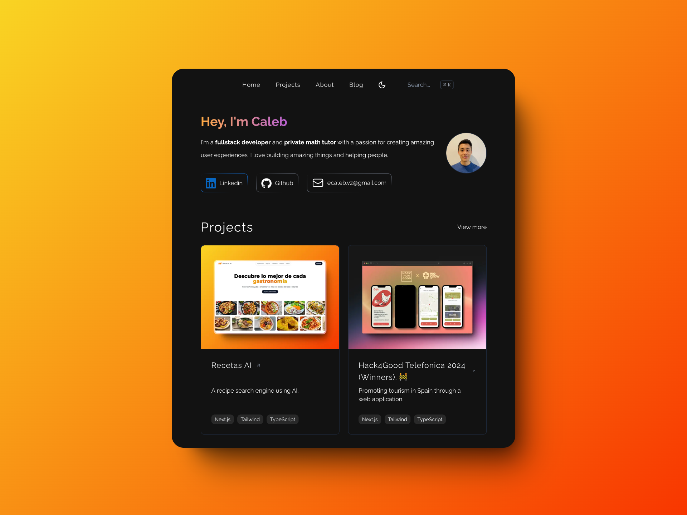

# Caleb Zamalloa - Personal Website built using Next.js



Stack used in this project

- Next.js
- Typescript
- Github API
- Tailwind CSS
- shadcn/ui
- Resend

## Environment Variables

To run this project, you will need to add the following environment variables to your .env file

`RESEND_API_KEY`

## Run Locally

Clone the project

```bash
  git clone https://github.com/ecaleb97/ecaleb.dev.git
```

Go to the project directory

```bash
  cd ecaleb.dev
```

Install dependencies

```bash
  pnpm install
```

Start the server

```bash
  pnpm dev
```
